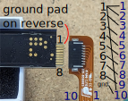
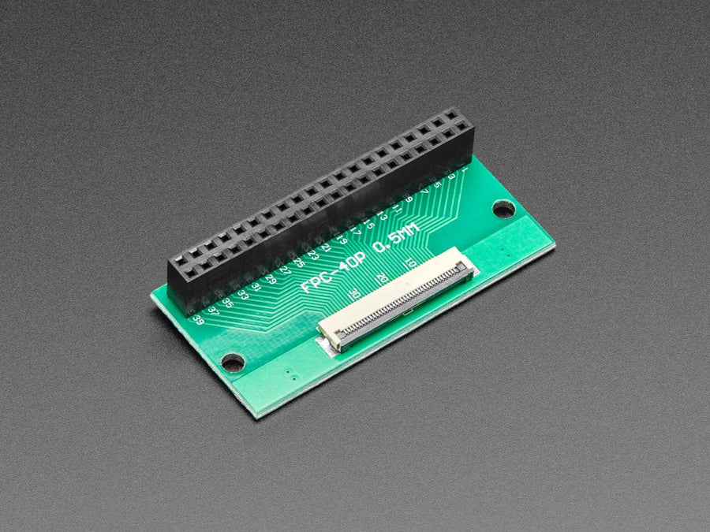

# Hardware

## Pin allocation

From the [datasheet], section 6.3, the pinout is:

| Pin no | Pin name | Function | Direction |
| --- | --- | --- | --- |
| 1 | GND | Power ground | - |
| 2 | N_RST | Reset | Input |
| 3 | DR | Data Ready | Output |
| 4 | I2C_DATA | I2C Data | I/O |
| 5 | I2C_CLK |I2C Clock | Input |
| 6 | USB D- | USB DM | I/O |
| 7 | USB D+ | USB DP | I/O |
| 8 | +5V | Power supply | - |

[datasheet]: ./datasheets/neonode_users-guide_DOC011447159.pdf

The pins important to us for I2C communication (see [datasheet], section 6.4.2) are 1, 3, 4, 5, 8 (basically ignoring the USB pins).

This pinout ([datasheet], section 6.3) corresponds to the following on the physical device. The device outputs 8 pins, but the FPC cable is 10 pins. Also shown on the image is how these correspond.

I acquired a 40-pin [FPC connector from PiHut] in order to connect the module to an Arduino. The 10-pin cable can be connected to the end of this to get access to the pins using jumper wires.

[FPC connector from PiHut]: https://thepihut.com/products/40-pin-fpc-to-straight-2x20-idc-female-socket-header
